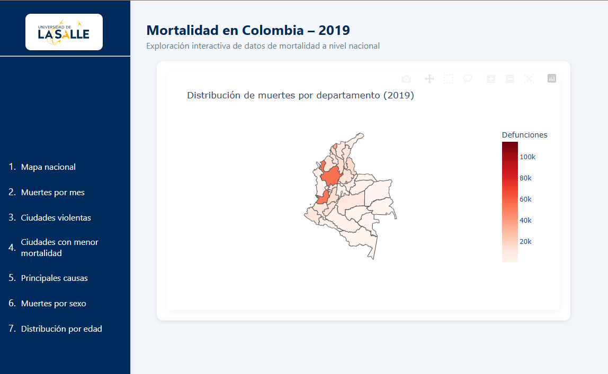
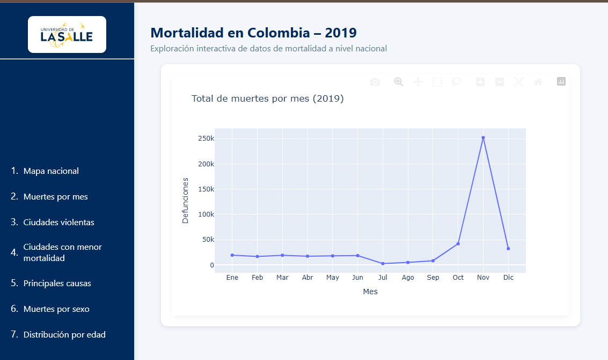
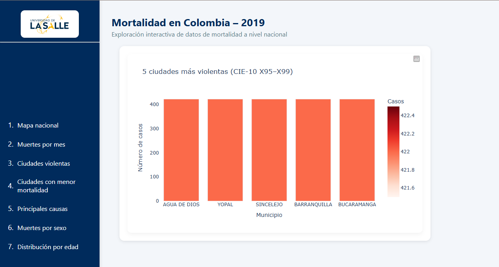
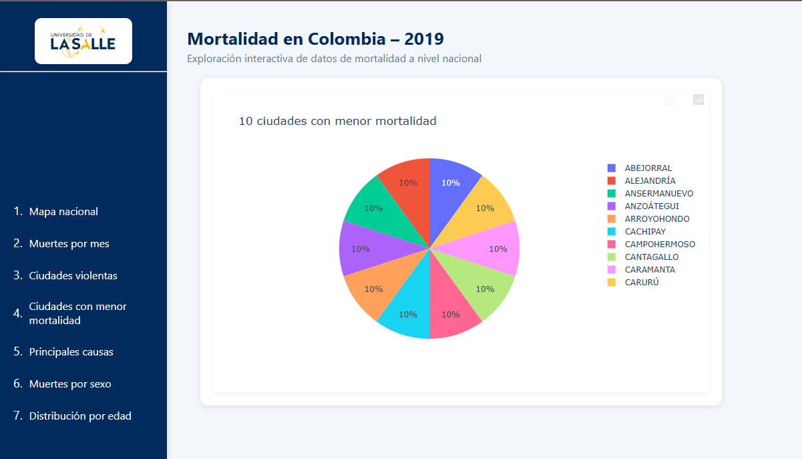
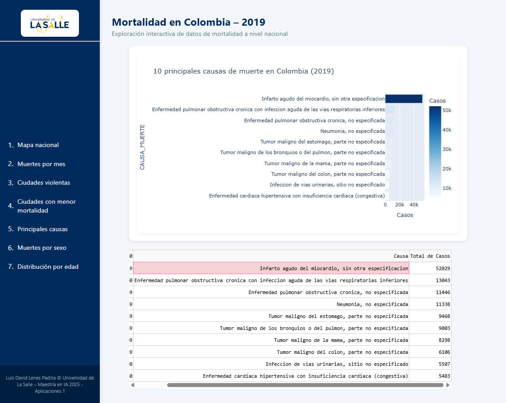
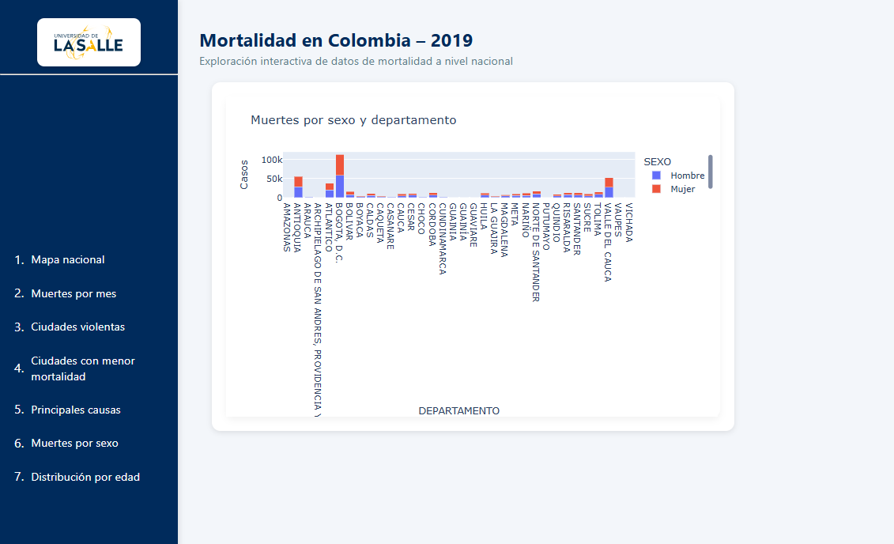
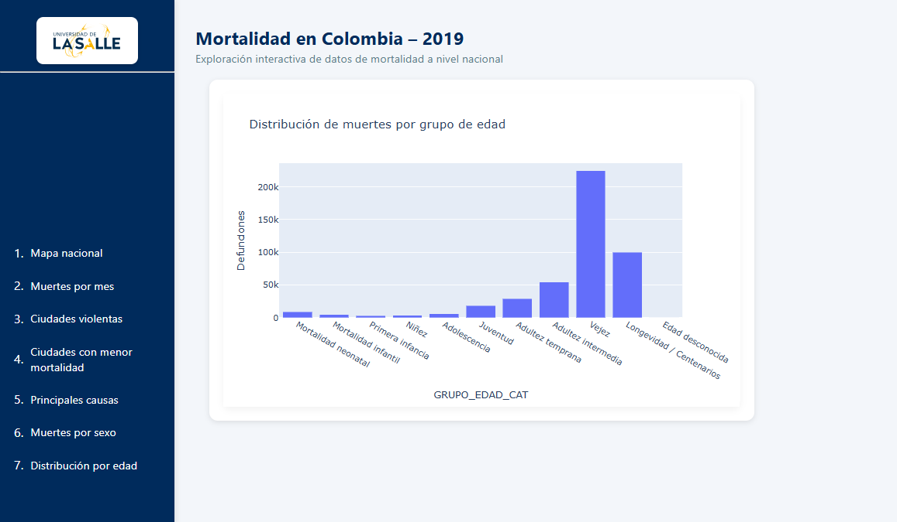

#  Mortalidad en Colombia – 2019  
**Aplicación Dash – Maestría en Inteligencia Artificial – Universidad de La Salle**

---

##  Introducción del proyecto
Esta aplicación web interactiva analiza los registros de mortalidad en Colombia durante el año 2019, con base en los datos oficiales del DANE.  El propósito es ofrecer una visualización clara y dinámica de los principales patrones de mortalidad según variables como departamento, mes, causa, sexo y grupo etario.

El proyecto fue desarrollado en el marco de la asignatura **Aplicaciones 1** del programa de Maestría en Inteligencia Artificial de la Universidad de La Salle.

---

##  Objetivo
La aplicación busca:
- Identificar los departamentos y municipios con mayores tasas de mortalidad.  
- Analizar la evolución mensual de las defunciones.  
- Clasificar las principales causas de muerte según los códigos CIE-10.  
- Explorar la distribución de la mortalidad por sexo y grupo de edad.  

---

##  Estructura del proyecto

├── assets/ # Archivos estáticos (CSS, logotipos, estilos)
   ├── style.css
   └── logo-azul-unisalle.svg

 ├── data/ # Archivos base de datos (Excel y GeoJSON)
   ├── NoFetal2019_CE_15-03-23.xlsx
   ├── Divipola_CE_.xlsx
   ├── CodigosDeMuerte_CE_15-03-23.xlsx
   └── col_departamentos.geojson

 ├── src/ # Código fuente de la aplicación
   ├── app.py # Definición principal de la app Dash
   ├── layout.py # Layout con el sidebar y el contenido principal
   └── callbacks.py # Callbacks interactivos y procesamiento de datos

├── requirements.txt # Dependencias del entorno
├── Procfile # Configuración para despliegue en la nube
└── README.md # Documento de descripción del proyecto

##  Requisitos

Para ejecutar este proyecto, se requieren las siguientes librerías:

dash==2.17.1
plotly==5.23.0
pandas==2.2.2
openpyxl==3.1.5
gunicorn==22.0.0

Despliegue en la nube (DigitalOcean App)

Pasos seguidos en el despliegue:

Crear un repositorio en GitHub con toda la estructura del proyecto.

Conectar la cuenta de GitHub a DigitalOcean App Platform.

Configurar:

Runtime: Python 3.11

Start Command: gunicorn src.app:server

Port: 8080 (automático).

Desplegar y verificar los logs de ejecución.

Publicar la URL generada, por ejemplo:
👉 https://king-prawn-app-ywaxt.ondigitalocean.app

Software utilizado

Python 3.11

Dash y Plotly (para visualización interactiva)

Pandas y OpenPyXL (para manejo de datos Excel)

Gunicorn (para el servidor WSGI en producción)

DigitalOcean App Platform (para el despliegue web)

Instalación y ejecución local

1-Clonar el repositorio:

git clone https://github.com/luisdavid5360/mortalidad-colombia-2019.git
cd mortalidad-colombia-2019

2-Crear entorno virtual e instalar dependencias:
python -m venv venv
source venv/bin/activate  # o venv\Scripts\activate en Windows
pip install -r requirements.txt

3- Ejecutar la aplicación localmente:
python -m src.app

Visualizaciones y hallazgos

 1. Mapa Nacional de Mortalidad

Muestra la distribución de las muertes por departamento en 2019.
Se observa una mayor concentración en Bogotá, Antioquia y Valle del Cauca, reflejando su alta densidad poblacional.

 2. Muertes por Mes

Evidencia un comportamiento estacional, con picos notables hacia los meses de julio y diciembre.

 3. Ciudades Más Violentas

Identifica los municipios con más muertes violentas (CIE-10 X95–X99).
Se destacan ciudades grandes con mayores tasas de homicidio.

4.Ciudades con menor Mortaliada
Ilustra en un grafico circular las ciudades con menor mortalidad

 5. Principales Causas de Muerte

Las principales causas incluyen enfermedades cardiovasculares, cáncer y enfermedades respiratorias, según los códigos CIE-10.

 6. Muertes por Sexo
Se evidencia una mayor mortalidad masculina en edades productivas y una tendencia al aumento en la vejez.

 7. Distribución y Edad
Grafico de barras donde se ilustra el grupo etario que mes mortalidad tiene.

 Créditos

Autor: Luis David Lenes Padilla
Programa: Maestría en Inteligencia Artificial – Universidad de La Salle
Asignatura: Aplicaciones 1
Año: 2025

